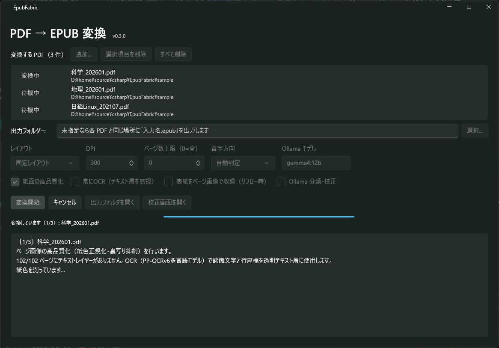

# EpubFabric

[日本語](README.ja.md)

A Windows tool that converts PDFs—both scanned documents and PDFs with text layers—into searchable, selectable, and screen-reader-accessible EPUB 3 files.

EpubFabric is designed as a fixed-layout EPUB production environment. It preserves the original page appearance with page images while adding text information through a combination of automated processing—OCR, layout analysis, and a local LLM (Ollama)—and human proofreading. See the [basic design document (Japanese)](docs/基本設計.md) for details.

See [CHANGELOG.md](CHANGELOG.md) for changes in each version.

## Features



- **Fixed-layout EPUB** (default): Stores each PDF page as one EPUB page. A transparent, positioned text layer is placed over the page image, preserving the original appearance while enabling search, text selection, and screen-reader access. The first page is designated as the cover (`cover-image`)
- **Vertical writing support**: Automatically detects writing direction for each page. Vertically written books use right binding, right-to-left reading order, and vertical text layers (`writing-mode: vertical-rl`). Horizontally written pages mixed into a vertical publication are also handled correctly
- **Reflowable EPUB**: Generates an EPUB with chapter structure through layout analysis (heading, column, figure, and caption detection) and paragraph merging. With `--cover-image`, the first page is stored as an image without being converted to text. This prevents OCR errors from decorative cover text from entering the body
- **OCR**: Local OCR using RapidOcrNet and the multilingual PP-OCRv6 ONNX model, with Japanese support. Models are downloaded automatically on first use
  - Deskewing: Recognition uses a corrected image prepared only for OCR, and coordinates are transformed back to the original image; the displayed image is not modified
  - Low-confidence noise filtering: Prevents misrecognized lines from covers and decorative pages from entering the body
- **Layout pattern classification**: Classifies each page as horizontal single-column, horizontal two-column, vertical single-column, or vertical two-column, then applies pattern-specific reflow order. Complex horizontal layouts with three to four uneven columns fall back to recursive gutter detection
- **Page enhancement** (`--enhance`): Normalizes paper-color white balance to remove yellowing and dullness, and uses smoothstep whitening to suppress bleed-through and uneven backgrounds. Because no geometric transformation is applied, text-layer coordinates are unaffected. Covers and full-page photographs are skipped automatically
- **Optional Ollama integration**: Uses a local LLM to semantically correct block types and heading levels and to correct OCR errors. Multiple safeguards—including equal-length replacement only and URL protection—reject unintended LLM rewrites before they are applied
- **Size optimization**: Recompresses page images at JPEG quality 85 with a maximum long edge of 2,200 pixels by default; both settings are configurable. Text-layer coordinates are unaffected
- **Evaluation reports**: Tune conversion accuracy with an HTML report that places the page image and detected blocks alongside the generated EPUB fragment

## Requirements

- Windows 10/11 (x64)
- [.NET 10 SDK](https://dotnet.microsoft.com/)
- Optional: [Ollama](https://ollama.com/) when using `--ollama`; the default model is `gemma4:12b`

## Build

```powershell
git clone https://github.com/fukuyori/EpubFabric.git
cd EpubFabric

# Build and test (also creates the Release distribution build)
.\scripts\build.ps1

# Debug configuration without a distribution build
.\scripts\build.ps1 -Configuration Debug -Runtime ""

# Skip or filter tests, or perform a clean build
.\scripts\build.ps1 -SkipTests
.\scripts\build.ps1 -TestFilter ColumnDetectorTests
.\scripts\build.ps1 -Clean
```

You can also use `dotnet build` and `dotnet test` directly.

There are two scripts, and **only `build.ps1` compiles the application**. `build-installer.ps1` runs with `--no-build`; it only turns the existing build output into a distribution and does not compile or test anything.

| Script | Purpose | Compiles |
|---|---|---|
| `build.ps1` | Builds and tests the solution | Yes |
| `build-installer.ps1` | Arranges distribution folders, creates the installer, and optionally signs binaries | No |

Running `build.ps1` followed by `build-installer.ps1` without arguments produces a complete installer.

## Create distributable executables

Because `build-installer.ps1` does not compile, first run `build.ps1` to create the self-contained distribution build, which includes the .NET runtime. Both scripts default to Release / win-x64, so they work together without additional arguments.

```powershell
# 1) Create the distribution build
.\scripts\build.ps1

# 2) Create the distribution
#   CLI:       publish\EpubFabric.Cli\win-x64\
#   GUI:       publish\EpubFabric.App\win-x64\
#   Installer: publish\installer\EpubFabric-Setup-<version>.exe
.\scripts\build-installer.ps1

# Create only the distribution folders, without an installer
.\scripts\build-installer.ps1 -SkipInstaller

# Package the CLI as a single executable
.\scripts\build-installer.ps1 -SingleFile

# Output only the CLI (the installer is skipped automatically)
.\scripts\build-installer.ps1 -SkipGui
```

The resulting `EpubFabric.exe` (GUI) and `epubfabric-cli.exe` (CLI) run directly on Windows systems without a separate .NET installation.

If `build-installer.ps1` is run before a distribution build exists, it stops and displays the command that must be run first.

### Installer (Inno Setup)

By default, `build-installer.ps1` creates a setup executable. [Inno Setup 6](https://jrsoftware.org/isinfo.php) must be installed. If it is unavailable, the script stops with an explanatory message; use `-SkipInstaller` to create only the distribution folders.

```powershell
.\scripts\build-installer.ps1
# -> publish\installer\EpubFabric-Setup-0.3.0.exe

# Specify a version (defaults to <Version> in Directory.Build.props)
.\scripts\build-installer.ps1 -Version 1.0.0

# Rebuild only the installer from existing publish output
.\scripts\build-installer.ps1 -InstallerOnly
```

### Code signing

With `-Sign`, the script uses the Windows SDK `signtool.exe` to sign the GUI and CLI executables, and uses Inno Setup's signing support for the installer and uninstaller. A code-signing certificate must be installed in the Windows certificate store.

```powershell
# Automatically select the best code-signing certificate from the certificate store
.\scripts\build-installer.ps1 -Sign

# Select a certificate by SHA-1 thumbprint
.\scripts\build-installer.ps1 -Sign `
    -CertificateThumbprint 0123456789ABCDEF0123456789ABCDEF01234567

# Add an RFC 3161 timestamp
.\scripts\build-installer.ps1 -Sign `
    -TimestampUrl https://timestamp.example.com
```

No timestamp is added when `-TimestampUrl` is omitted. Use `-CertificateThumbprint` and `-TimestampUrl` together with `-Sign`. The script does not accept PFX files or passwords on the command line.

The installer supports Japanese and English, and can install either for all users under Program Files or for the current user under `%LocalAppData%\Programs`. After installation, launch the application from “EpubFabric” in the Start menu; creating a desktop shortcut is optional.

The GUI is the main application and is placed at the installation root. The CLI is installed under `cli\` as a supporting tool:

```
<installation directory>\
  EpubFabric.exe          GUI (main application)
  cli\epubfabric-cli.exe  CLI (supporting tool)
```

If the “Add to PATH environment variable” task is selected, entering `epubfabric` in Command Prompt or the Run dialog launches the GUI. The PATH entry is removed during uninstall. To use the CLI, open “EpubFabric CLI (Command Prompt)” from the Start menu.

## CLI usage

```powershell
# Display PDF information
dotnet run --project src\EpubFabric.Cli -- info input.pdf

# Create a fixed-layout EPUB (default)
dotnet run --project src\EpubFabric.Cli -- convert input.pdf --output book.epub

# Convert multiple PDFs in sequence (--output is an output directory;
# if omitted, each EPUB is written next to its source PDF)
dotnet run --project src\EpubFabric.Cli -- convert a.pdf b.pdf c.pdf --output out-dir

# Create a reflowable EPUB
dotnet run --project src\EpubFabric.Cli -- convert input.pdf --layout reflow

# In reflow mode, store the first page as a cover image without converting it to text
dotnet run --project src\EpubFabric.Cli -- convert input.pdf --layout reflow --cover-image

# Enhance scanned pages by normalizing paper color and suppressing bleed-through
dotnet run --project src\EpubFabric.Cli -- convert input.pdf --enhance

# Enable heading classification and OCR correction with Ollama
dotnet run --project src\EpubFabric.Cli -- convert input.pdf --ollama

# Configure page-image compression (defaults: quality 85, maximum long edge 2,200 px;
# use 0 to disable resizing)
dotnet run --project src\EpubFabric.Cli -- convert input.pdf --image-quality 90 --max-image-size 2600

# Create a conversion-accuracy report without generating an EPUB
dotnet run --project src\EpubFabric.Cli -- evaluate input.pdf --report report-dir
# -> Open report-dir\index.html in a browser

# Save analysis as a project, proofread it manually, and export an EPUB
dotnet run --project src\EpubFabric.Cli -- analyze input.pdf --project book.efproj
dotnet run --project src\EpubFabric.Cli -- export book.efproj --format epub
```

Main options:

| Option | Default | Description |
|---|---|---|
| `--layout <fixed\|reflow>` | `fixed` | Output layout |
| `--dpi <dpi>` | `300` | Page rasterization resolution |
| `--enhance` | Disabled | Enhance scanned pages by normalizing paper color and suppressing bleed-through |
| `--cover-image` | Disabled | In reflow mode, store the first page as a cover image without converting it to text. Ignored in fixed-layout mode because every page is already an image |
| `--vertical` / `--horizontal` | Auto-detect | Force the writing direction. By default, direction is detected for each page from line shapes; vertically written books use right binding, right-to-left reading order, and vertical text layers |
| `--image-quality <1-100>` | `85` | JPEG quality for fixed-layout page images |
| `--max-image-size <px>` | `2200` | Maximum long edge of a page image. Use `0` to disable resizing |
| `--ollama` | Disabled | Semantic classification and OCR correction with Ollama |
| `--ollama-model <model>` | `gemma4:12b` | Model to use |
| `--ollama-endpoint <url>` | `http://localhost:11434` | Ollama server |

## GUI usage

The WinUI 3 desktop application (`EpubFabric.App`) lets you build a list of PDFs and convert them in sequence.

- Select multiple files with “Add...” or drag and drop them into the window. Files can be dropped **one at a time to build the list incrementally**
- Each row shows its status at the left: waiting, converting, completed, failed, canceled, and so on. Edit the list with “Remove selected” and “Remove all”
- Set the destination with “Output folder.” If omitted, an `input-name.epub` file is created next to each PDF
- If one conversion fails, the remaining files are still processed. The final result shows the numbers of successful and failed conversions
- If you try to close the window during conversion, a confirmation dialog opens. “Exit” cancels the conversion and closes the application; “Continue conversion” returns to the window

When installed with the installer, launch “EpubFabric” from the Start menu or use the optional desktop shortcut.

Running during development:

```powershell
# Run directly during development
dotnet run --project src\EpubFabric.App

# Run a built executable directly (x64 example)
dotnet build src\EpubFabric.App
.\src\EpubFabric.App\bin\Debug\net10.0-windows10.0.26100.0\win-x64\EpubFabric.exe
```

The application uses an unpackaged configuration and bundles the Windows App SDK runtime, so neither MSIX registration nor a separate runtime installation is required.

## Project structure

```
src/
  EpubFabric.Cli          Command-line interface; displays pipeline progress in the console
  EpubFabric.App          Windows GUI (WinUI 3; executable: EpubFabric.exe): PDF list, options, and sequential conversion with progress
  EpubFabric.Pipeline     Conversion-pipeline orchestration shared by the CLI and GUI
  EpubFabric.Core         Data models and settings
  EpubFabric.Pdf          PDF loading, rasterization, and text-layer extraction (Docnet/PDFium)
  EpubFabric.Ocr          OCR (RapidOcrNet / PP-OCRv6), noise-line filtering, and model management
  EpubFabric.Imaging      Image processing (OpenCvSharp): figure detection and OCR preprocessing (deskewing)
  EpubFabric.Layout       Layout analysis: four-pattern classification, columns (ColumnDetector), headings, and paragraph merging
  EpubFabric.Ollama       Ollama integration: block classification and OCR text correction
  EpubFabric.Document     Document structuring and chapter division
  EpubFabric.Epub         EPUB 3 package generation (fixed layout and reflow)
  EpubFabric.Evaluation   Conversion-accuracy report generation
  EpubFabric.Persistence  Saving and loading project files (.efproj)
tests/
  EpubFabric.Tests        Unit tests (xUnit)
docs/
  基本設計.md              Overall design (Japanese)
  固定レイアウト開発方針.md  Fixed-layout development policy (Japanese)
```

## Conversion pipeline overview

1. **Rasterization**: Converts each page to PNG with PDFium at 300 dpi by default and composites it onto a white background
2. **Text acquisition**: Extracts character coordinates from PDF pages whose text layer meets the quality threshold. All other pages use OCR: deskewing during preprocessing, PP-OCRv6 recognition, and noise-line removal based on confidence and character type
3. **Layout analysis** (reflow only): Detects figures and boxed articles, classifies horizontal/vertical single/two-column patterns, applies pattern-specific reading order, estimates headings, and merges paragraphs
4. **Ollama correction** (optional): Semantically corrects block types and heading levels and fixes OCR recognition errors
5. **EPUB generation**: Fixed layout uses page images with transparent text layers; reflow produces structured XHTML chapters. Page images are recompressed before packaging

## License and acknowledgments

This project is released under the [GNU AGPLv3](LICENSE).

- OCR models: [RapidOCR](https://github.com/RapidAI/RapidOCR) (PP-OCRv6) / [RapidOcrNet](https://github.com/BobLd/RapidOcrNet)
- PDF rendering: [Docnet](https://github.com/GowenGit/docnet) (PDFium)
- Image processing: [OpenCvSharp](https://github.com/shimat/opencvsharp) / [SkiaSharp](https://github.com/mono/SkiaSharp)
- The page-enhancement method used by `--enhance` is an independent OpenCV implementation inspired by the paper-color statistical correction technique in Daiyuu Nobori's [DN_SuperBook_PDF_Converter](https://github.com/dnobori/DN_SuperBook_PDF_Converter) (AGPLv3)
